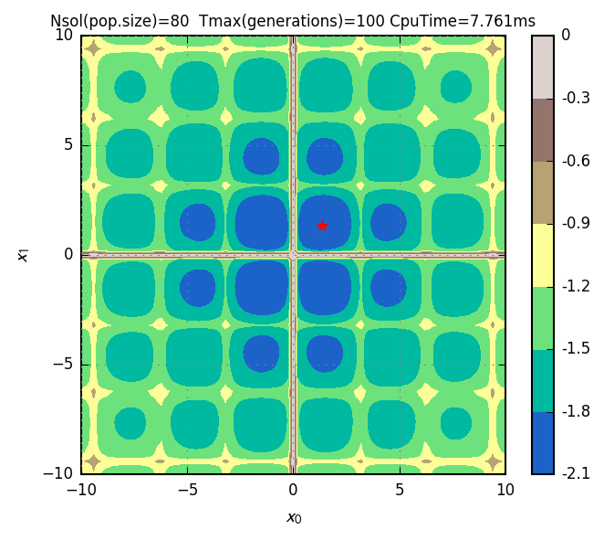

## Examples

[Check out more examples here](https://github.com/cpmech/goga/blob/master/examples/README.md)

<div id="container">
<p></p>
Output of cross-in-tray.go
</div>

```go
// objective function
func fcn(f, g, h, x []float64, y []int, cpu int) {
	f[0] = -0.0001 * Pow(Abs(Sin(x[0])*Sin(x[1])*Exp(Abs(100-Sqrt(Pow(x[0], 2)+Pow(x[1], 2))/Pi)))+1, 0.1)
}

// main function
func main() {

	// problem definition
	nf := 1 // number of objective functions
	ng := 0 // number of inequality constraints
	nh := 0 // number of equality constraints

	// the solver (optimiser)
	var opt goga.Optimiser
	opt.Default()                    // must call this to set default constants
	opt.FltMin = []float64{-10, -10} // must set minimum
	opt.FltMax = []float64{+10, +10} // must set maximum
	opt.Nsol = 80
	opt.Nsamples = 100

	// initialise the solver
	opt.Init(goga.GenTrialSolutions, nil, fcn, nf, ng, nh)

	// solve problem
	opt.RunMany("", "", false)

	// stat
	opt.PrintStatF(0)
}
```
